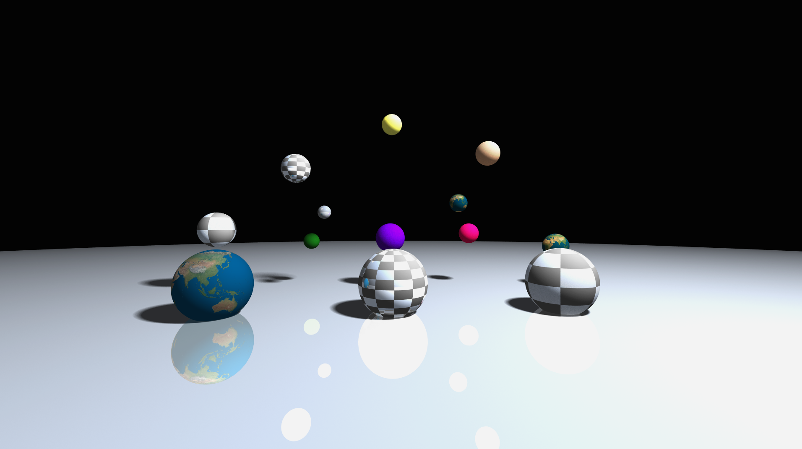
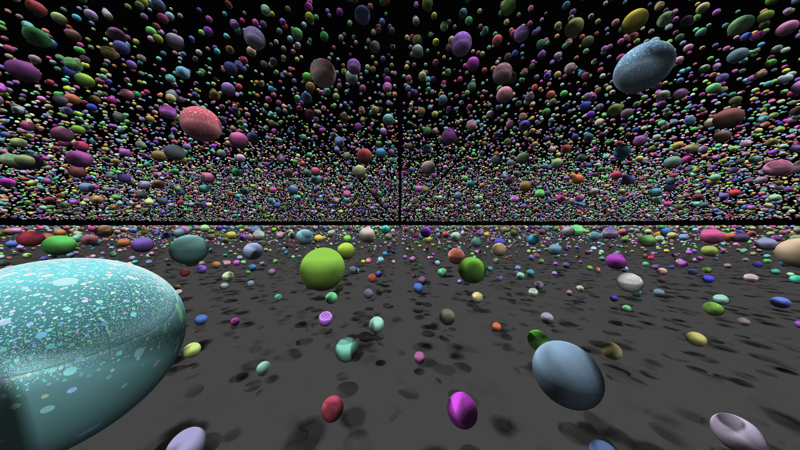
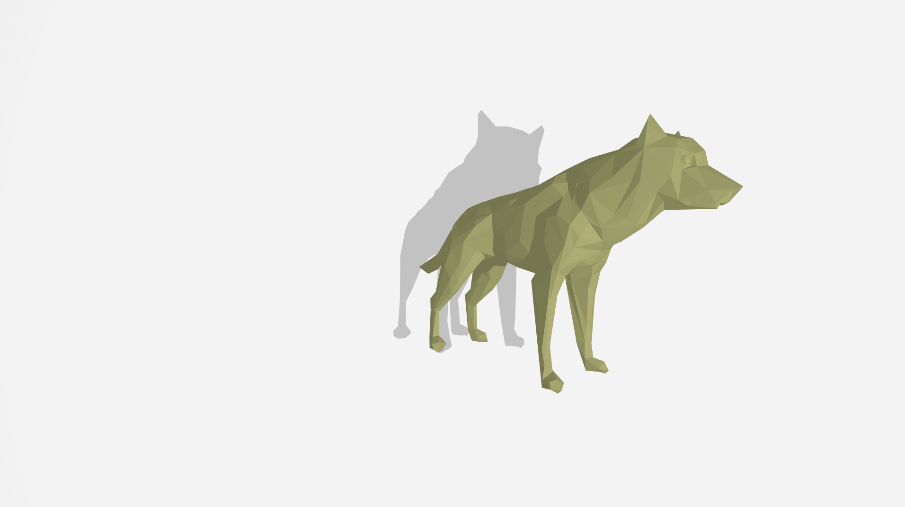

# miniRT - Distributed Ray Tracing Renderer

<div align="center">

```
    ███╗   ███╗██╗███╗   ██╗██╗██████╗ ████████╗
    ████╗ ████║██║████╗  ██║██║██╔══██╗╚══██╔══╝
    ██╔████╔██║██║██╔██╗ ██║██║██████╔╝   ██║   
    ██║╚██╔╝██║██║██║╚██╗██║██║██╔══██╗   ██║   
    ██║ ╚═╝ ██║██║██║ ╚████║██║██║  ██║   ██║   
    ╚═╝     ╚═╝╚═╝╚═╝  ╚═══╝╚═╝╚═╝  ╚═╝   ╚═╝   
```

### ⚡ A Lightning-Fast, Distributed Ray Tracing Engine

**Render photorealistic images across multiple machines with multi-threading, BVH acceleration, and real-time camera control**

[](https://42.fr)
[](LICENSE)
[](Makefile)
[](CONTRIBUTING.md)

[🚀 Quick Start](#-quick-start) • [✨ Features](#-features) • [📸 Gallery](#-gallery) • [📖 Documentation](#-documentation)

---

</div>

## 🎬 See It In Action

<div align="center">

### 🌈 Material Showcase
*Lambertian, Metal, and Glass materials with realistic light interactions*



### 🎨 Primitive Gallery
*Spheres, planes, cylinders and cones*


### 🔥 100,000 Spheres - BVH Acceleration
*Rendering 100K objects at interactive framerates*



### 🐺 Mesh Support
*Triangle-based mesh rendering with material support*



</div>

---

## 🚀 Quick Start

Get rendering in 60 seconds:

```bash
# One-line installation
bash <(curl -L https://raw.githubusercontent.com/4n4k1n/42-miniRT/refs/heads/master/setup.sh)

# Build
make

# Run a demo scene
./miniRT scenes/demo.rt
```

### 🌐 Want to try distributed rendering?

```bash
# Terminal 1 - Master Node
./miniRT --master scenes/solar_system.rt --port 9000

# Terminal 2 - Worker Node (same or different machine)
./miniRT --worker 192.168.1.100 --port 9000
```

**That's it!** Press ENTER in the master terminal and watch your scene render across multiple machines.

---

## ✨ Features

<table>
<tr>
<td width="50%">

### 🎯 Core Rendering
- 🌟 **Physically-based ray tracing** with global illumination
- 🎨 **Advanced materials**: Lambertian, Metal, Dielectric (glass)
- 🌈 **Soft shadows** with adjustable sample counts
- ✨ **Anti-aliasing** via Monte Carlo sampling (8-64 samples)
- 🗿 **Bump mapping** for surface detail
- 🔄 **Recursive reflections/refractions**

</td>
<td width="50%">

### ⚡ Performance
- 🚀 **Multi-threaded** rendering (auto-detects CPU cores)
- 📊 **BVH acceleration** (500x faster on complex scenes!)
- 🔥 **Aggressive optimizations** (`-Ofast`, LTO, SIMD)
- 🎯 **Cache-optimized** data structures
- 📈 **Real-time FPS counter**

</td>
</tr>
<tr>
<td width="50%">

### 🌐 Distributed Computing
- 🖥️ **Master-Worker architecture** for render farms
- 🔀 **Dynamic load balancing** across workers
- 📡 **Real-time camera updates** broadcast to all nodes
- 🔄 **Fault-tolerant** - workers can disconnect/reconnect
- 🎛️ **Tile-based rendering** (256x256 pixels)

</td>
<td width="50%">

### 🎮 Interactive Features
- ⌨️ **Real-time camera control** (WASD + Arrow keys)
- 🔄 **Runtime toggles** for AA and lighting
- 🎬 **Live preview** as tiles complete
- 🖼️ **Multiple rendering modes**: Local, Master, Worker
- 📊 **Performance monitoring**

</td>
</tr>
</table>

---

## 🎯 Why miniRT?

<div align="center">

| 🐌 Traditional Ray Tracer | ⚡ miniRT |
|:------------------------:|:--------:|
| Single-threaded | Multi-threaded (all cores) |
| O(n) intersection tests | O(log n) with BVH |
| Single machine only | Distributed across network |
| Static camera | Real-time camera control |
| Minutes per frame | Interactive framerates |

</div>

### 📊 Performance Benchmark

Scene with **10,000 spheres** at 1920x1080:

```
Without BVH: 0.01 FPS  (100 seconds per frame) 🐌
With BVH:    5.00 FPS  (0.2 seconds per frame)  ⚡

Speedup: 500x faster!
```

Scene rendered across **8 worker machines**:

```
1 Worker:  60 seconds  (baseline)
2 Workers: 32 seconds  (1.88x faster) 
4 Workers: 17 seconds  (3.53x faster)
8 Workers:  9 seconds  (6.67x faster)

Near-linear scaling!
```

---

## 🎨 Supported Primitives & Materials

<table>
<tr>
<td width="50%">

### 📐 Geometric Primitives
- ⚫ **Sphere** (`sp`) - Perfect spherical objects
- 📏 **Plane** (`pl`) - Infinite flat surfaces  
- 🥫 **Cylinder** (`cy`) - Finite cylinders with caps
- 🍦 **Cone** (`co`) - Conical shapes
- 🔺 **Pyramid** (`py`) - Four-sided pyramids
- 🔷 **Triangle** (`tr`) - For mesh support

</td>
<td width="50%">

### 🎨 Material & Texture Types

**Lambertian (Matte)**
```
sp 0,0,0 2 255,100,100 L
```
Perfect diffuse surfaces

**Metal (Reflective)**
```
sp 0,0,0 2 255,255,255 M
```
Specular reflection

**Glass (Dielectric)**
```
sp 0,0,0 2 255,255,255 G:1.5
```
Refraction + reflection (IOR: 1.5)

**Checker Texture**
```
sp 0,0,0 2 255,255,255 L tx:checker:12
```
Procedural checker pattern

**Bump Mapping**
```
sp 0,0,0 2 255,255,255 L bm:assets/earth.png:1.0
```
Surface detail from image

</td>
</tr>
</table>

---

## 🎮 Interactive Controls

<div align="center">

| 🎯 Action | ⌨️ Key | 🎯 Action | ⌨️ Key |
|:-------:|:-----:|:-------:|:-----:|
| Move Forward | `W` | Move Up | `Space` |
| Move Backward | `S` | Move Down | `Shift` |
| Move Left | `A` | Look Up | `↑` |
| Move Right | `D` | Look Down | `↓` |
| Look Left | `←` | Look Right | `→` |
| Toggle Anti-Aliasing | `R` | Toggle Lighting | `L` |
| Exit | `ESC` | - | - |

</div>

---

## 📖 Scene File Format

Create stunning scenes with our simple text format:

```rt
# Ambient lighting (intensity R,G,B)
A   0.15   255,255,255

# Camera (position orientation FOV)
C   0,1,5   0,0,0.5   70

# Light source (position brightness [R,G,B optional])
L   -5,8,3   0.8

# Sphere (center diameter R,G,B [material] [texture/bump])
sp  0,0,-1   1.2   255,255,255   L tx:checker:12

# Sphere with bump mapping
sp  3,0,-1   1.2   50,205,50   bm:assets/earth.png:1.8

# Glass/dielectric sphere
sp  0,3,-1.8   0.4   240,230,140   G:1.5

# Metal sphere
sp  -3,0,-1   1.2   255,255,255   M

# Plane (point normal R,G,B [material])
pl  -1,1,-40   0,0,1   200,200,255

# Cylinder (center axis diameter height R,G,B [material])
cy  3,4.5,11.5   1,1,0   0.7   7   139,69,19

# Cone (base_center axis diameter height R,G,B)
co  0,-3,12   0.23,1,0   3.1   11   205,133,63
```

**Material Options:**
- `L` - Lambertian (diffuse/matte)
- `M` - Metal (reflective)
- `G:index` - Glass/dielectric (e.g., `G:1.5`)
- `tx:checker:scale` - Checker texture
- `bm:path:scale` - Bump mapping from image

**Check out** `scenes/` for 15+ example scenes including:
- 🪐 `solar_system.rt` - Planetary configurations
- 🌈 `material_showcase.rt` - All material types
- 🔥 `10000_spheres.rt` - BVH stress test
- 🧊 `ice.rt` - Ice cream cone scene

---

## 🛠️ Installation

### 📋 Prerequisites

<table>
<tr>
<td width="33%">

**🐧 Linux**
```bash
sudo apt-get install \
  build-essential \
  cmake \
  libglfw3-dev
```

</td>
<td width="33%">

**🍎 macOS**
```bash
# Install Homebrew first
brew install \
  cmake \
  glfw
```

</td>
<td width="33%">

**📦 Build**
```bash
git clone [repo]
cd miniRT
make
```

</td>
</tr>
</table>

---

## 🎓 Architecture Overview

miniRT uses a sophisticated multi-mode architecture:

```
                    ┌─────────────────┐
                    │   Command Line  │
                    └────────┬────────┘
                             │
                ┌────────────┼────────────┐
                │            │            │
         ┌──────▼──────┐ ┌──▼──────┐ ┌──▼────────┐
         │ Local Mode  │ │ Master  │ │  Worker   │
         │   (Solo)    │ │  Mode   │ │   Mode    │
         └──────┬──────┘ └──┬──────┘ └──┬────────┘
                │            │            │
                │       ┌────▼────┐       │
                │       │ Network │◄──────┘
                │       │Protocol │
                │       └─────────┘
                │
         ┌──────▼───────────────────────────┐
         │    Multi-threaded Render Loop    │
         │  ┌──────────┬──────────────┐     │
         │  │   BVH    │ Ray Tracing  │     │
         │  │Traversal │   Pipeline   │     │
         │  └──────────┴──────────────┘     │
         └──────────────────────────────────┘
```

### 🔍 Key Components

- **🎯 Ray Tracing Pipeline** - Recursive path tracing with material interaction
- **📊 BVH Acceleration** - Hierarchical spatial indexing for fast intersection
- **🧵 Thread Pool** - Work-stealing multi-threaded rendering
- **🌐 Network Protocol** - Custom binary protocol for distributed rendering
- **🎬 Real-time Updates** - Camera changes broadcast instantly to all workers

**[📚 Detailed Architecture Documentation →](docs/CODE_DOCUMENTATION.md)**

---

## 📊 Project Statistics

<div align="center">

| Metric | Count |
|:------:|:-----:|
| Lines of Code | ~15,000 |
| Source Files | 80+ |
| Supported Primitives | 6 |
| Material Types | 3 (+bump mapping) |
| Example Scenes | 15+ |
| State Machine Diagrams | 10 |
| Network Message Types | 7 |

</div>

---

## 🤝 Contributing

We welcome contributions! This is a 42 School project, but improvements are always appreciated.

```bash
# Fork, clone, and create a branch
git checkout -b feature/amazing-feature

# Make your changes and test
make re
./miniRT scenes/demo.rt

# Submit a pull request
```

**Guidelines:**
- Follow the [42 Norm](https://github.com/42School/norminette)
- Test with multiple scenes
- Update documentation
- Add state machine diagrams for architectural changes

---

## 📚 Documentation

- **[📖 Code Documentation](docs/CODE_DOCUMENTATION.md)** - Comprehensive developer guide
- **[🎨 Scene Format Guide](#-scene-file-format)** - Create custom scenes
- **[⚡ Performance Guide](#-performance-benchmark)** - Optimization tips
- **[🔧 Troubleshooting](#troubleshooting)** - Common issues and solutions

### 📊 Architecture Diagrams

<details>
<summary><b>🔍 View State Machine Diagrams</b></summary>

- [High-Level Application Flow](docs/high-level_application.svg)
- [Local Mode](docs/local_mode.svg)
- [Master Mode](docs/master_mode.svg)
- [Worker Mode](docs/worker_mode.svg)
- [Network Communication](docs/network_comunication.svg)
- [Ray Tracing Pipeline](docs/ray_tracing.svg)
- [BVH Acceleration](docs/bvh.svg)
- [Thread Pool](docs/thread_pool.svg)
- [Tile Queue](docs/tile_queue.svg)
- [Error Handling](docs/error_handling.svg)

</details>

---

## 🌟 Inspiration & Resources

- 📚 [Ray Tracing in One Weekend](https://raytracing.github.io/) - Peter Shirley
- 📖 [Physically Based Rendering](https://pbr-book.org/) - PBRT Book
- 🎓 [Scratchapixel](https://www.scratchapixel.com/) - Computer Graphics Tutorial
- 🖥️ [MLX42](https://github.com/codam-coding-college/MLX42) - Graphics Library

---

## 👥 Authors

<div align="center">

**Developed at 42 School**

[](https://github.com/4n4k1n)
[](https://github.com/nweber23)

</div>

---

## 📜 License

This project is licensed under the MIT License - see the [LICENSE](LICENSE) file for details.

---

## 🎯 Troubleshooting

<details>
<summary><b>🔧 Common Issues</b></summary>

### Build Issues

**MLX42 build fails:**
```bash
git clone https://github.com/codam-coding-college/MLX42.git
cd MLX42
cmake -B build && cmake --build build -j4
cd .. && make
```

**GLFW not found:**
```bash
# Linux
sudo apt-get install libglfw3-dev

# macOS
brew install glfw
```

### Runtime Issues

**Slow rendering:**
- ✅ Enable BVH (enabled by default)
- ✅ Reduce anti-aliasing samples
- ✅ Lower resolution for testing
- ✅ Use distributed rendering

**Worker can't connect:**
- ✅ Check firewall settings
- ✅ Verify IP address: `./miniRT --worker localhost --port 9000`
- ✅ Ensure master is running first

</details>

---

<div align="center">

### ⭐ If you found this project helpful, please consider giving it a star!

**Made with ❤️ at 42 School**

[🔝 Back to Top](#minirt---distributed-ray-tracing-renderer)

</div>
